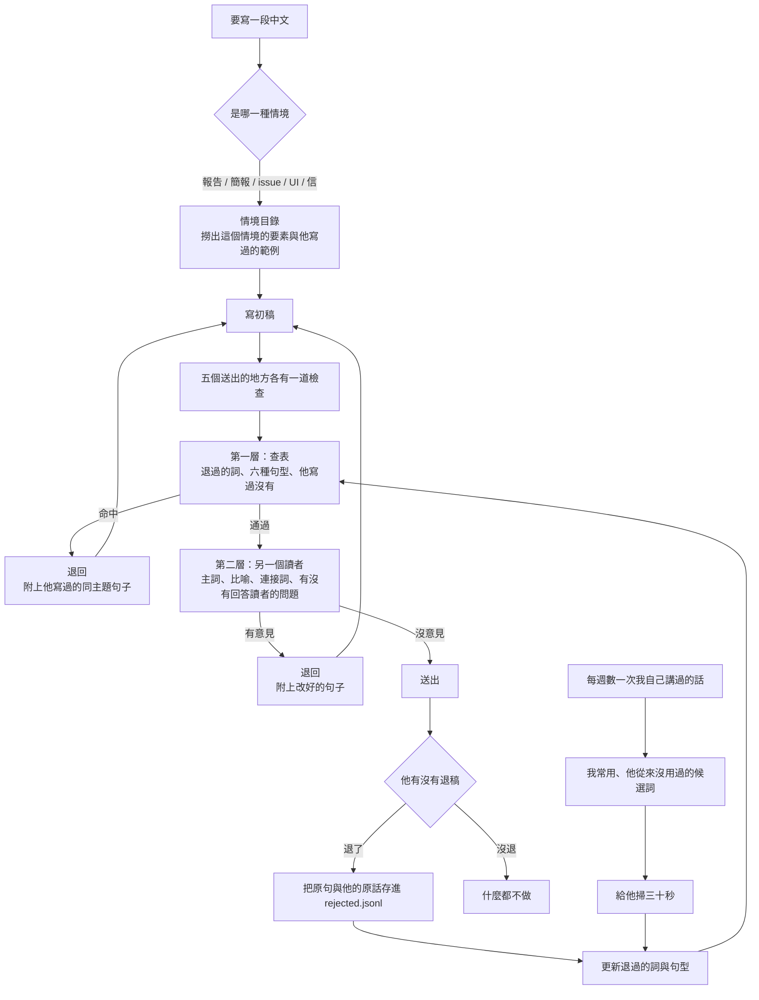
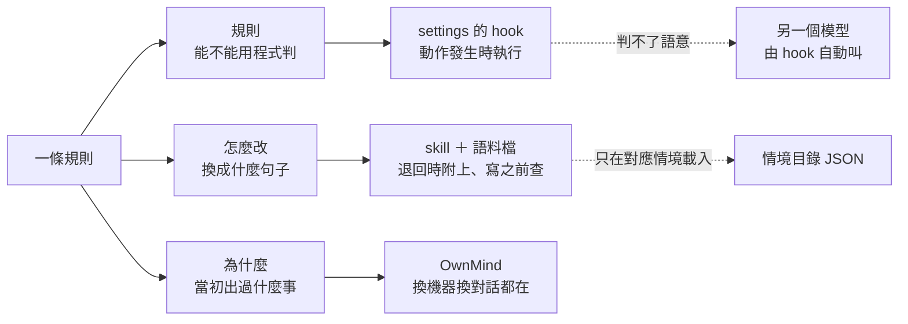
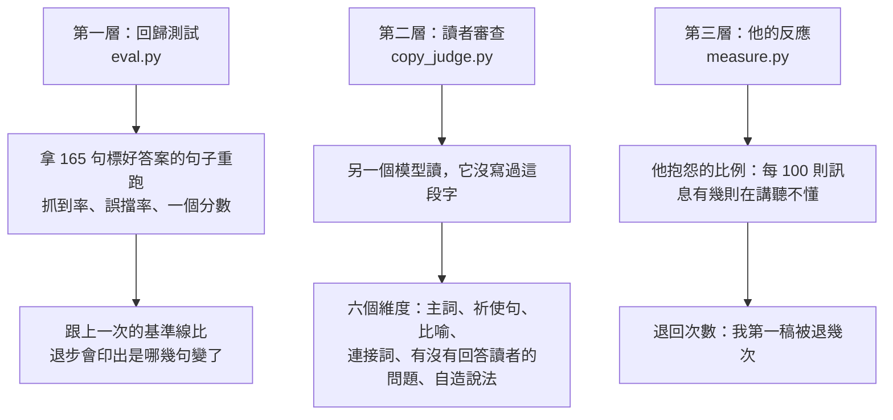
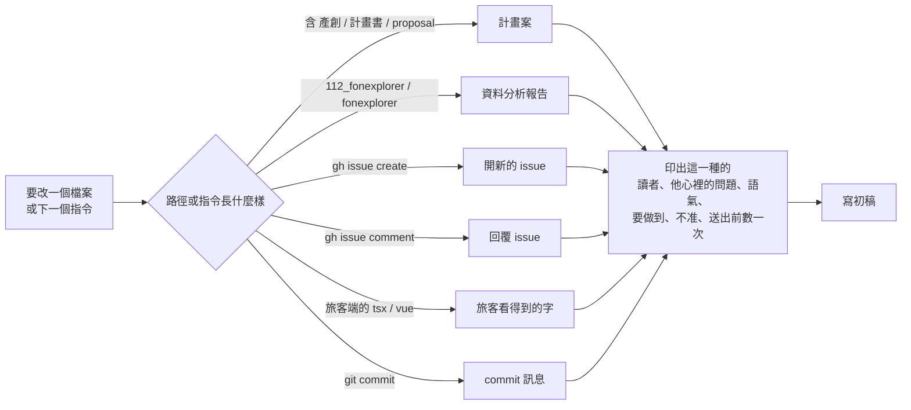

# 中文文案品管制度

## 這是什麼

一套讓 AI 寫中文時被自動檢查的機制。它不是第 198 條規則，而是把既有的規則
拆開放到五個工具上，讓每一條規則在動作發生的當下被執行，而不是躺在文件裡等人想起來。

## 它能幫你做到什麼

寫壞的句子在送到你眼前之前就被退回，退回訊息裡直接給你寫過的同類型句子。
你退過的用詞不會再出現第二次，而且新的口頭禪會在你開口退它之前先被找出來。
每次改規則都可以跑一次回歸測試，看得出這一版比上一版好還是壞。

## 你現在要做什麼

看一下 `~/.claude/copy-samples/sources/` 裡抽進來的那幾份對不對。2026-09-15 從你的
Dropbox 抽了 63 份你掛名的計畫書、服務建議書、成果報告與工作會議簡報，共 31.8 萬個中文字；
合約、個人資料、出差申請表沒有碰。那幾份決定整套制度的上限，因為第二個讀者拿它當基準，
退回訊息也從它裡面撈句子給我照著改。

抽的方式是認檔名：有 `vin` 或你的名字的才抽。**如果還有你寫的東西不在那個命名規則裡，
告訴我放在哪，我補進來。**

---

## 一、現在量到的狀況

| 量的是什麼 | 數字 | 意思 |
|---|---|---|
| 規則總數 | 197 條鐵律 ＋ 65 KB 全域規則 | 規則不缺 |
| 你抱怨的比例 | 上週 3.6%、這週 4.1% | 規則越多，抱怨越多 |
| 查表那一關的抓到率 | 25.4% | 你退過的句子，四句只攔得下一句 |
| 查表那一關的誤擋率 | 0.0% | 你親手寫的句子沒有被誤擋 |
| 語料總量 | 41.9 萬字，其中書面 31.8 萬字 | 從他的 Dropbox 抽進來之後補齊了 |
| 第二個讀者的考試成績 | 抓到率 55%、誤擋率 27% | 沒到及格線，所以它只提醒、不擋人 |

**他抱怨的不是用詞。** 九月以來他的 964 則訊息裡有 39 則在抱怨，拆開看：

| 他在抱怨什麼 | 幾則 | 佔比 |
|---|---|---|
| 聽不懂、看不懂、看不下去 | 26 | 67% |
| 沒跑該跑的檢查 | 5 | 13% |
| 零碎、沒重點、太長 | 3 | 8% |
| 文案爛 | 2 | 5% |
| 不像台灣人寫的 | 2 | 5% |
| 自己發明的詞 | 1 | 3% |

所以查表那一關雖然擋得掉 40 個他退過的詞，對他真正的困擾只碰到 3%。**他讀不懂的原因是主詞不見了、
整段沒有連接詞、這一段沒回答他的問題，那幾種要讀懂句子才判得出來。** 制度因此分成兩層，
而且重心在第二層，不是第一層。

---

## 二、整套怎麼運作



**兩層的分工是統計出來的，不是分派的。** 查表那一層抓到率 25.4%，
剩下的四分之三交給讀第二遍的人，因為那幾種要讀懂句子才判得出來。

---

## 三、一條規則怎麼拆到五個工具

一條規則有三個部分：規則、怎麼改、為什麼。現在三份都擠在 `CLAUDE.md`，
所以規則沒有人執行、怎麼改讀過就忘、為什麼佔掉每一輪的篇幅。



| 工具 | 它在哪一刻起作用 | 放規則的哪一部分 | 它自己的破綻 |
|---|---|---|---|
| `settings.json` 的 hook | 動作發生的當下，可以退回 | 規則，加上退回時要附的那幾句 | 只認得字不懂語意，所以要由它去叫另一個模型 |
| 語料與查詢用的表 | 被 hook 查 | 他寫過的句子、他退過的詞 | 髒了整套失效，所以要有產生程式與過濾 |
| skill | 被主動叫起來的時候 | 怎麼寫：流程、範本、用詞對照 | 沒叫就等於不存在，所以要由 hook 強制 |
| `CLAUDE.md` | 每一輪都在 | 只放每次造句都用得到的那幾行 | 越長越沒用，讀了不等於照做 |
| OwnMind | 換機器、換工具、開新對話 | 鐵律的標題與觸發條件、專案事實 | 標題送到不等於讀了，更不等於照做 |

**規則：能用程式檢查的不進常駐篇幅；只在特定情境成立的不進常駐篇幅。**

---

## 四、五個送出的地方

少檢查一個，東西就從那裡送出去。

| 送出的地方 | 掛在哪 | 判斷條件 |
|---|---|---|
| 改檔案 | PreToolUse `Edit｜Write｜MultiEdit｜NotebookEdit` | 內容有中文，且路徑不是規則檔與測試檔 |
| GitHub 留言與開單 | PreToolUse `Bash` | 指令是 `gh issue/pr comment・create・edit`，取 `--body` 與 `--title` |
| commit 訊息 | PreToolUse `Bash` | 指令是 `git commit` 或 `git tag`，取 `-m` |
| 交事情給別人做 | PreToolUse `Agent` | 交出去的指示裡有中文 |
| 回話 | Stop | 這一則回話的中文長度到門檻 |

回話那一關第二次進來只講擋下來的那幾個，以避免要引用一個退過的詞的時候被連續退到上限。

---

## 五、評鑑機制

評鑑分三層，因為三層各自防的東西不一樣。



### 第一層：回歸測試（改規則之後一定要跑）

```bash
python3 ~/.claude/copy-samples/eval.py
```

句子從三個地方來，全部是真的發生過的：他退我稿時打出來的原句、規則檔裡的兩欄對照表、
以及他自己打的句子。目前 63 句該被擋、102 句不該被擋。

改完規則跑一次，退步會直接印出是哪幾句從擋變成放行。**這一關已經故意弄壞驗過**：
加一條假規則之後分數從 25.4 掉到 22.5，而且點名了被誤擋的三句。

| 這一版 | 抓到率 | 誤擋率 | 分數 |
|---|---|---|---|
| 2026-09-15 基準線 | 25.4% | 0.0% | 25.4 |

### 第二層：讀者審查（判語意，查表判不了的那四分之三）

判的人是另一個模型，它沒寫過這段字，所以看得到寫的人自己看不到的東西。
它先讀他親手寫的句子與他退過的句子當基準，再讀要檢查的稿。

**語意判官出場之前要先考過，考不過不准擋人。** 語意判官自己也會判錯，而且錯得很像對的：
第一版沒有給它好的例子，結果它把他親手寫的六句全部退掉，還要改成
「本則歷史通知不予顯示」這種公文。所以語意判官的規則裡寫明「把他的句子改成書面語是錯的，
不是改進」，而且要定期考試。

考題是真的發生過的：他下一句就抱怨的那一段是「該退」，他自己打的長訊息是「該過」。
目前收得到他抱怨過的稿 384 段、他自己寫的 642 段。盲考，語意判官只看到稿，
看不到他的抱怨，也看不到對話。

```bash
python3 ~/.claude/copy-samples/build_gold.py      # 收考題
python3 ~/.claude/copy-samples/judge_exam.py --n 10
```

及格線是抓到率 70% 以上、誤擋率 15% 以下。成績存在 `judge-score.json`，
考不過就自動降級成只提醒、不擋人。2026-09-15 最近一次的成績是抓到 55%、誤擋 27%，門檻訂在 8 分，沒有到及格線，所以它現在只提醒。
中間曾經考到抓到 70%、誤擋 10%，但是那一版的評分規範沒有被保留下來，而且考題只有 11 對 11，一個樣本就等於 9 個百分點，所以 70% 與 55% 之間分不出是真的退步還是抽樣造成的。

**考題出錯過兩次，兩次都讓分數變成假的，記在這裡以避免再犯：**

| 錯在哪 | 結果 | 改成 |
|---|---|---|
| 對照組拿他自己打的訊息 | 兩邊文體不一樣，語意判官分辨的是誰寫的，不是好不好 | 對照組換成我自己寫、而他沒抱怨的那幾段 |
| 只給語意判官我的稿，不給他當下問的那一句 | 分數是反的：被抱怨的那幾段平均 0.7 分，沒被抱怨的 1.7 分 | 他問的那一句一起送進去，第一條規則就是「他問的事有沒有被回答」 |

第二件是這一輪最要緊的發現：**他說「聽不懂」多半不是文筆問題，是他問的那件事沒有被回答。**
只看稿判不出來。文件沒有他當場問的那一句，就拿情境目錄裡讀者心裡的問題代替。

另外留了兩份固定的稿當快速回歸：

```bash
python3 ~/.claude/hooks/copy_judge.py --file ~/.claude/copy-samples/judge-test-good.md --force   # 要過
python3 ~/.claude/hooks/copy_judge.py --file ~/.claude/copy-samples/judge-test-bad.md  --force   # 要退
```

### 第三層：他的反應（唯一不會作弊的那一層）

```bash
python3 ~/.claude/copy-samples/measure.py
```

兩條數字要一起看：

| 抱怨比例 | 退回次數 | 代表什麼 |
|---|---|---|
| 降 | 降 | 第一稿就寫對了，這才是目標 |
| 降 | 沒降 | 檢查在做事，我沒學到 |
| 沒降 | 沒降 | 檢查有洞 |

---

## 六、表怎麼自己長

你退過的詞永遠是已經發生的事，所以清單永遠落後一個。回頭數過，你退過的 40 個詞裡有 25 個，
在你開口退之前我就已經用過十次以上，最多的一個超過一千次。

```bash
python3 ~/.claude/copy-samples/mine_candidates.py --dry --top 30
```

它數我自己講過的 449 萬字，扣掉你寫過的，剩下「我常用、你一次都沒用過」的排出來。
那是一份給你掃三十秒的短名單，不是判定；檢查對候選只在同一份稿裡重複三次以上才提醒，
你點頭之後才搬進清單改成一律擋。

**語料必須用程式重建，不准手動貼。** 你退我稿的時候會順手把我的爛句子一起打出來，
有時候整段貼回來要我改，檢查自己印的回報也會被當成你打的字。這三種混進語料，
我的用字就變成「你寫過的詞」，2026-09-15 查出 40 個詞裡有 20 個因此被誤放。

```bash
python3 ~/.claude/copy-samples/build_vin_corpus.py
```

---

## 七、檔案在哪

| 檔案 | 放什麼 |
|---|---|
| `~/.claude/hooks/coined_word_guard.py` | 第一層：查表 |
| `~/.claude/hooks/copy_judge.py` | 第二層：另一個讀者 |
| `~/.claude/copy-samples/vin-corpus.txt` | 他寫過的句子，含聊天 |
| `~/.claude/copy-samples/vin-corpus-formal.txt` | 他自己寫的文件，寫報告時撈這一份 |
| `~/.claude/copy-samples/coined-terms.json` | 退過的詞與尚未確認的候選 |
| `~/.claude/copy-samples/copy-patterns.json` | 六種寫法 |
| `~/.claude/copy-samples/rejected.jsonl` | 我寫了什麼、他說要改成什麼 |
| `~/.claude/copy-samples/eval-set.jsonl` | 標好答案的句子 |
| `~/.claude/copy-samples/retrieve.py` | 撈他寫過的同主題句子 |
| `~/.claude/copy-rules/情境目錄.json` | 十二種情境的要素與檢查項 |
| `~/.claude/copy-rules/scenario.py` | 認出這次在寫哪一種，只印那一種 |

---

## 八、情境目錄

同一個人在不同情境要看到不同的東西。寫計畫書要嚴謹周密、用詞一絲不苟；
開 issue 要用情境溝通，把原因、目的、做法講清楚，而且要配圖。
所以要素不能只有一套，要照情境分。

**這份目錄是被查的，不是被讀的。** 讀一份十二種情境的規範，跟讀第 198 條規則一樣會忘。
改檔案或下指令的當下，由程式認出這是哪一種，只印出那一種的要素，其餘十一種不佔篇幅。



十二種情境，一共 126 條要做到、109 條不准、129 條送出前數得出來的檢查。
每一條都附了他的原話或既有規則的標題當出處，沒有出處的在查證那一關就被挑出來了。

| 情境 | 讀的人 | 這一種最要緊的那一件 |
|---|---|---|
| 計畫案／補助申請書 | 審查委員與計畫承辦 | 每一條機制後面要接一句它要防什麼，用「以避免＿＿」收尾 |
| 資料分析報告 | 通路 窗口、行銷同事、主管 | 每一段第一句要回答讀者三題其中一題，粗體小標寫判斷不寫數字 |
| 進度／狀態彙整 | Vin、後台同事 | 寫清楚哪些已經上線、哪些還沒，不要只寫做了什麼 |
| 決策用簡報 | 要按鈕的主管 | 頁數等於他要做的決定數，單頁內文上限 150 字 |
| 開一張新的 issue | 後台同事 或接手的工程師 | 寫成一個人的行動：誰想做什麼、遇到什麼、所以要改什麼 |
| 回覆 issue | 提單的那個人 | 先回答他問的是或不是；同一件事只留一則留言 |
| 旅客看得到的字 | 旅客 | 只用他眼前看得到的詞，空狀態要寫下一步 |
| 後台看得到的字 | 每天在填那幾格的人 | 用她畫面上原本的欄位名，不要另外取一個白話名字 |
| 對外的電子郵件 | 外部窗口 | 主旨寫他要決定的那件事 |
| 規格文件 | 要照著做的人 | 條件寫成人做過的動作，不是資料的狀態 |
| commit 訊息與 PR | 未來要查的人 | 寫改完誰會看到什麼差別 |
| 回 Vin 的話 | Vin | 第一句就是結論，段落數不超過他要做的決定數 |

查一種情境的完整內容：

```bash
python3 ~/.claude/copy-rules/scenario.py --list
python3 ~/.claude/copy-rules/scenario.py --id data-report --full
python3 ~/.claude/copy-rules/scenario.py --path analysis/112_fonexplorer.py
```

---

## 九、這份制度自己怎麼維護

| 什麼時候 | 做什麼 | 指令 |
|---|---|---|
| 他退一句稿 | 當場把原句與他的原話加進退過的詞或句型 | 直接改 `coined-terms.json` |
| 改完任何規則 | 跑回歸測試，退步就回去改 | `python3 ~/.claude/copy-samples/eval.py` |
| 每週 | 數一次候選詞，給他掃三十秒 | `python3 ~/.claude/copy-samples/mine_candidates.py --dry` |
| 每週 | 看他抱怨的比例與退回次數 | `python3 ~/.claude/copy-samples/measure.py` |
| 語料有新的來源 | 重建語料，不准手動貼 | `python3 ~/.claude/copy-samples/build_vin_corpus.py` |
| 他退了一種新情境 | 加進情境目錄，補 `scenario.py` 的路徑樣式 | 改 `情境目錄.json` |
